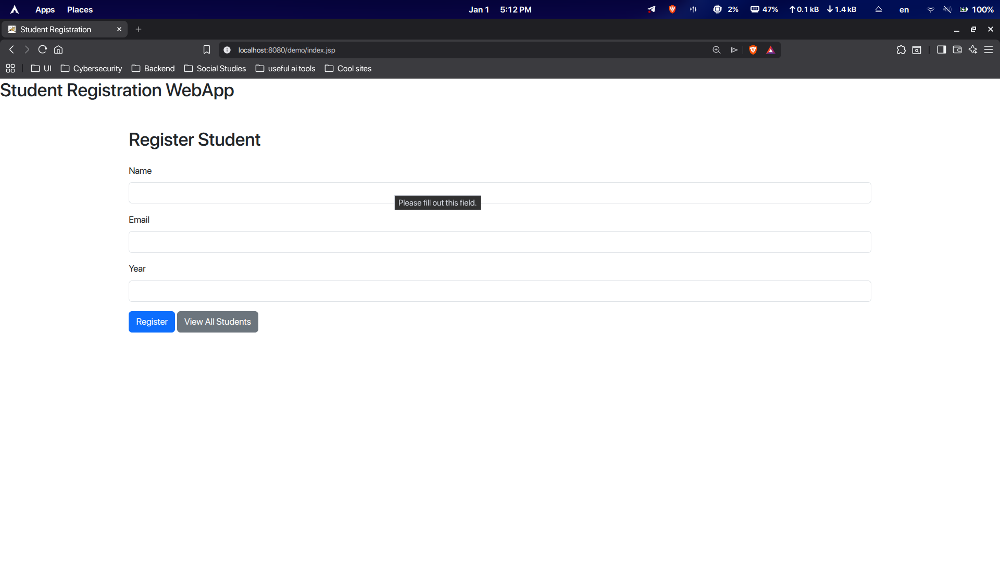

# Student Registration Web Application

A full Java-based web application for registering and managing student records using **Java Servlets**, **JSP**, **PostgreSQL**, and **Apache Tomcat 10**.  
This project follows clean architecture principles and is suitable for academic, learning, and portfolio use.

---
## 📸 Screenshots

### Student Registration Page

### View All Students Page

---
## 📌 Overview

This application allows users to:

- Register students using a web form
- Store student data in a PostgreSQL database
- View all registered students in a tabular format
- Ensure data integrity with server-side validation
- Use a clean and responsive UI powered by Bootstrap

The project is intentionally kept simple but **correctly structured**, focusing on **fundamentals done right**.

---

## 🛠 Technologies Used

| Layer | Technology |
|-----|-----------|
Backend | Java (Servlet API – Jakarta EE)
Frontend | JSP, HTML, CSS, Bootstrap 5
Database | PostgreSQL 18
Build Tool | Maven
Server | Apache Tomcat 10
IDE | VS Code
OS | Linux (Debian-based)

---

### Component Description

- **RegisterServlet**  
  Handles student registration logic and inserts data into PostgreSQL.

- **ShowAllServlet**  
  Fetches all student records and forwards them to JSP for rendering.

- **index.jsp**  
  Student registration form (Bootstrap-styled).

- **show_all.jsp**  
  Displays registered students in a table.

---

